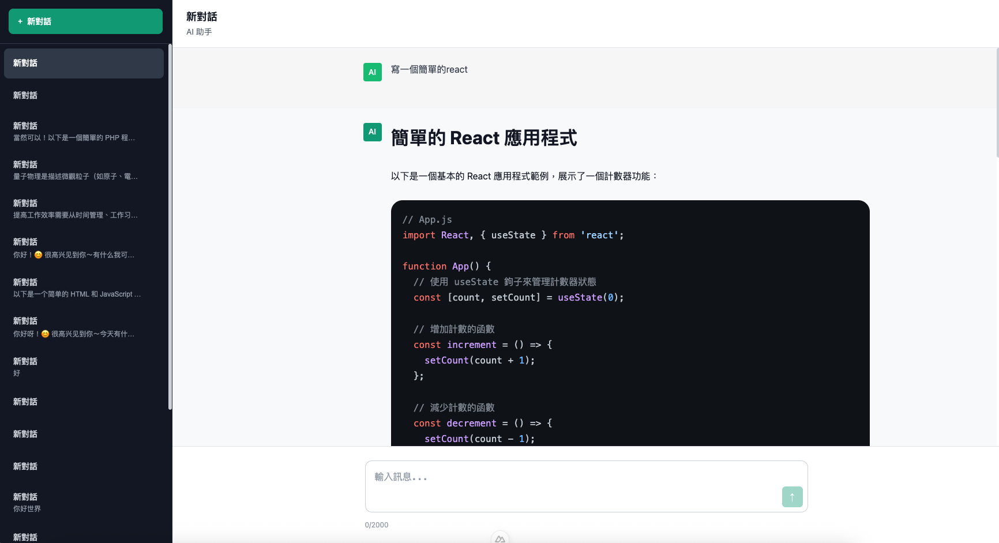
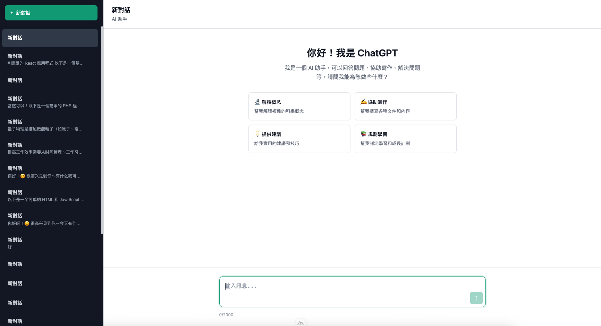
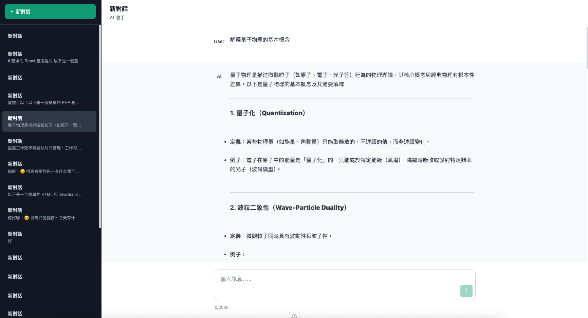

# 🧠 AI Chat Assistant

一個**前後端分離**的 AI 聊天平台：前端採用 **Nuxt 3**，後端為 **ASP.NET Core 9 (.NET 8+)**，資料儲存於 **PostgreSQL**，並整合 **DeepSeek AI** 模型生成對話。具備良好擴充性，可支援多模型切換（如 OpenAI、Gemini 等）。





---

## 📦 技術架構

| 模組    | 技術                             |
| ------- | -------------------------------- |
| 前端    | Nuxt 3                           |
| 後端    | ASP.NET Core 9 (Web API)         |
| 資料庫  | PostgreSQL                       |
| AI 模型 | DeepSeek（支援 AI Factory 擴充） |

---

## 📁 專案結構

```
/project-root
├── client/                        # Nuxt 前端專案
├── server/                        # .NET 後端 API 專案
│   ├── Controllers/               # AiController、ChatController 等
│   ├── Services/                  # 各 AI 模型實作
│   ├── Factory/                   # AiFactory：依 provider 建立服務
│   ├── Models/                    # Conversation、Message 模型
│   ├── Common/                    # ErrorCode and ApiResponse
│   ├── appsettings.json
│   ├── appsettings.Development.json
│   └── ...

```

---

## ⚙️ 環境需求

- .NET 9 SDK+
- Node.js 18+
- PostgreSQL（需預先建立連線成功）
- DeepSeek API 金鑰

---

## 🚀 快速啟動

### 1. 下載專案並切換資料夾

```bash
git clone https://github.com/linyuhao8/llm-api-chatbot.git
cd server
```

---

### 2. 建立資料庫（PostgreSQL）

請先建立資料庫連線：

```
Database: chat
Username: postgres
Password: 1234
Port: 5432
```

---

### 3. 設定後端 API 環境

### 🔧 建立 `appsettings.json`

> 放置於 server/ 目錄下

```json
{
  "ConnectionStrings": {
    "DefaultConnection": "Host=localhost;Port=5432;Database=chat;Username=postgres;Password=1234"
  },
  "DeepSeek": {
    "ApiKey": "sk-xxxxxxx"
  },
  "FrontendUrl": "http://localhost:3000"
}
```

### 🔧 建立 `appsettings.Development.json`

```json
{
  "Logging": {
    "LogLevel": {
      "Default": "Information",
      "Microsoft.AspNetCore": "Warning"
    }
  }
}
```

---

### 4. 還原並啟動後端

```bash
dotnet restore
dotnet ef database update  # 建立資料表
dotnet run
```

後端 API 啟動在：[http://localhost:5208](http://localhost:5208/)

---

### 5. 啟動前端 Nuxt

```bash
cd ../client
npm install
npm run dev

```

前端啟動在：[http://localhost:3000](http://localhost:3000/)

---

## 🧩 API 說明

### AI 模型相關

| 方法   | 路徑                             | 說明                       |
| ------ | -------------------------------- | -------------------------- |
| `POST` | `/api/Ai/ask`                    | 使用 AI 回覆（不儲存訊息） |
| `POST` | `/api/Chat/{conversationId}/ask` | 使用 AI 並儲存對話與訊息   |

### Chat 對話相關

| 方法   | 路徑                                     | 說明                   |
| ------ | ---------------------------------------- | ---------------------- |
| `GET`  | `/api/Chat/conversations`                | 取得所有對話           |
| `POST` | `/api/Chat/conversations`                | 建立新對話             |
| `GET`  | `/api/Chat/users/{userId}/conversations` | 根據使用者取得所有對話 |
| `GET`  | `/api/Chat/conversations/{id}/messages`  | 取得某個對話的訊息     |
| `POST` | `/api/Chat/conversations/{id}/messages`  | 新增訊息至對話中       |
| `POST` | `/api/Chat/{conversationId}/ask`         | 發送訊息並使用 AI 回覆 |

---

## 🧱 資料模型

### `Conversation.cs`

```csharp
public class Conversation
{
    [Key]
    public int Id { get; set; }
    public string? UserId { get; set; }
    public string? Title { get; set; }
    public DateTime CreatedAt { get; set; } = DateTime.UtcNow;
    public ICollection<Message> Messages { get; set; } = new List<Message>();
}
```

### `Message.cs`

```csharp
public class Message
{
    [Key]
    public int Id { get; set; }

    [Required]
    public int ConversationId { get; set; }

    [ForeignKey("ConversationId")]
    public Conversation Conversation { get; set; } = null!;

    [Required]
    public RoleType Role { get; set; } = RoleType.User;

    [Required]
    public string Content { get; set; } = string.Empty;

    public DateTime CreatedAt { get; set; } = DateTime.UtcNow;
}

```

---

## 🧾 統一 API 回應格式

所有 API 回應統一為以下格式：

```json
{
  "success": true,
  "data": {},
  "errorMessage": null,
  "errorCode": null,
  "errorDetail": null
}
```

錯誤碼定義於：`Common/ErrorCode.cs`

---

## 🏗️ AI Factory 架構說明

支援多模型服務註冊，可透過 provider 名稱動態取得：

```csharp
public class AIServiceFactory
{
    private readonly IEnumerable<IAIService> _services;

    public AIServiceFactory(IEnumerable<IAIService> services)
    {
        _services = services;
    }

    public IAIService GetService(string provider)
    {
        return _services.FirstOrDefault(s => s.Provider == provider)
            ?? throw new Exception($"AI Provider '{provider}' not found");
    }
}
```

目前支援：

- ✅ DeepSeek
- 🔧 OpenAI / Gemini（可擴充中）
